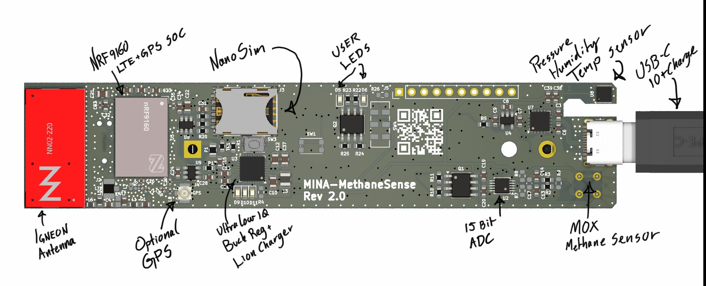
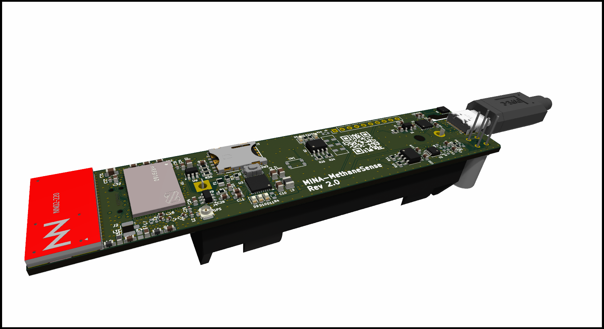
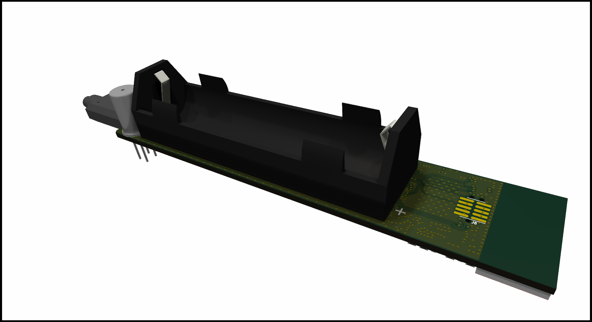
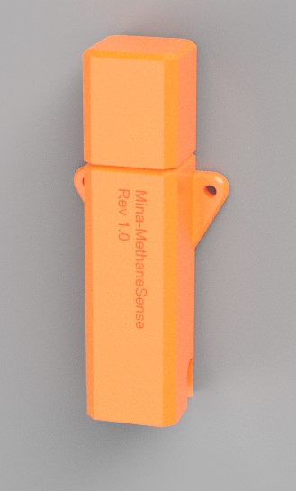
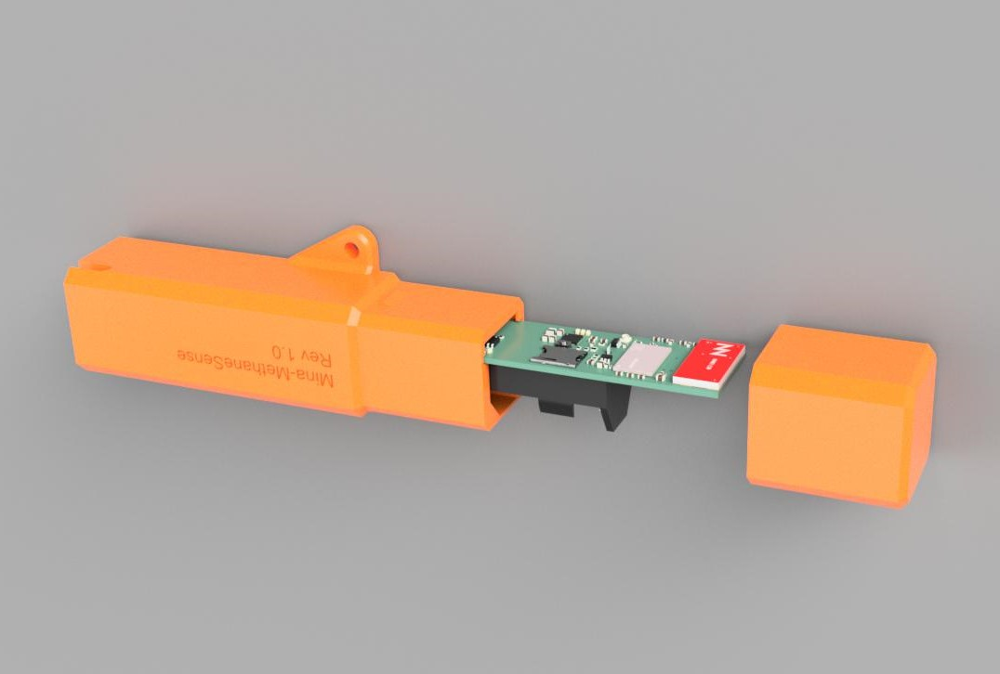

# NRF MethaneSense
 

Open Source hardware kicad source files for a NRF9160 based methane sensor utilizing MOX sensor.

Low power design with an estimated 80ua average current consumption measuring Methane, temp, pressure and humidity every ten minutes and transmitting once per hour. estimated battery life is 4.5 years from a 2500mah  18650 liion cell

It has an option for a GPS if necessary, but this will cause reduced battery life further. 

[PCB layout (Ibom)](https://htmlpreview.github.io/?https://raw.githubusercontent.com/fredriknk/msense/DOCUMENTATION/ibom_Methanesense_v2.0.0.html)

[SCHEMATIC](./DOCUMENTATION/methanesense_schematic.pdf)

## FRONT

## BACK

## Enclosure
Enclosure proposal. Simple 3d printed design snap lock, potential for epoxy fill for moisture resistance.

## Documentation

[NRF9160SOC](./DOCUMENTATION/nRF9160_PS_v2.0.pdf)

[ADC](./DOCUMENTATION/ads1113.pdf)

[Temp/press/humidity sensor](./DOCUMENTATION/bst-bme680-ds001.pdf)

[Powersupply PMIC](./DOCUMENTATION/nPM1300_PS_v1.0.pdf)

[MOX Sensor](./DOCUMENTATION/tgs8410_product_infomation(en)_rev05.pdf)

[Ignion Antenna Report](./DOCUMENTATION/Antennadesign/report_SERVICE_39decf06-800e-49d8-9982-bb3e38f49783.pdf)
