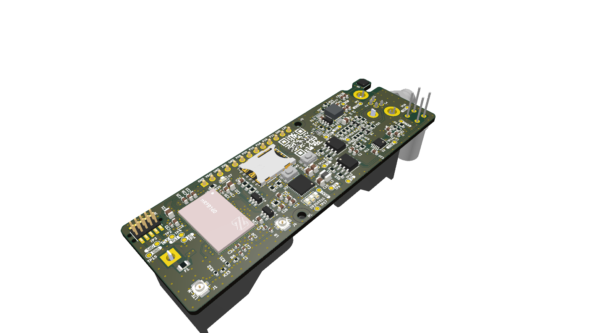
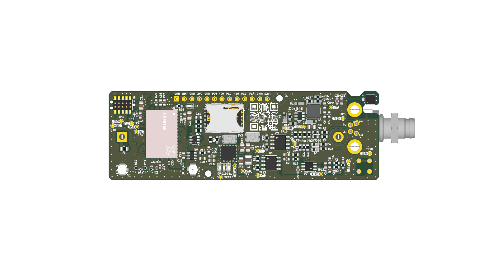
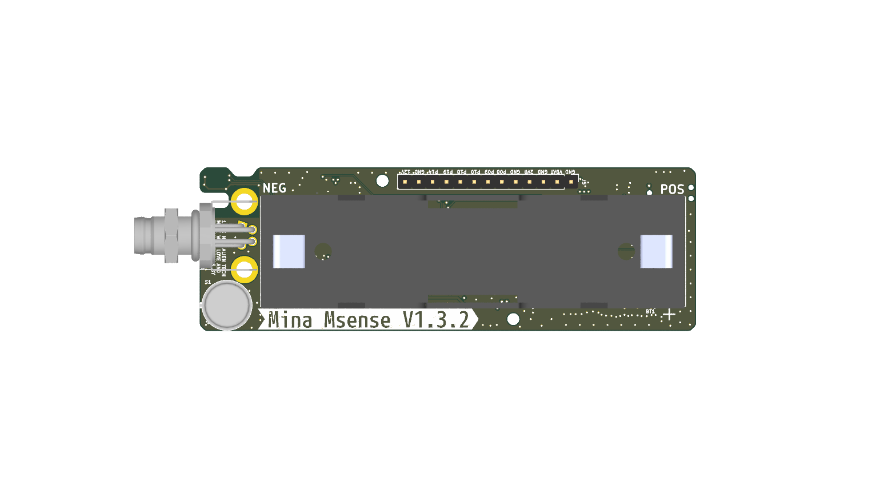
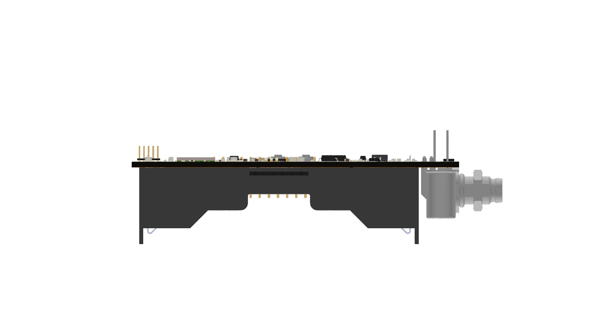
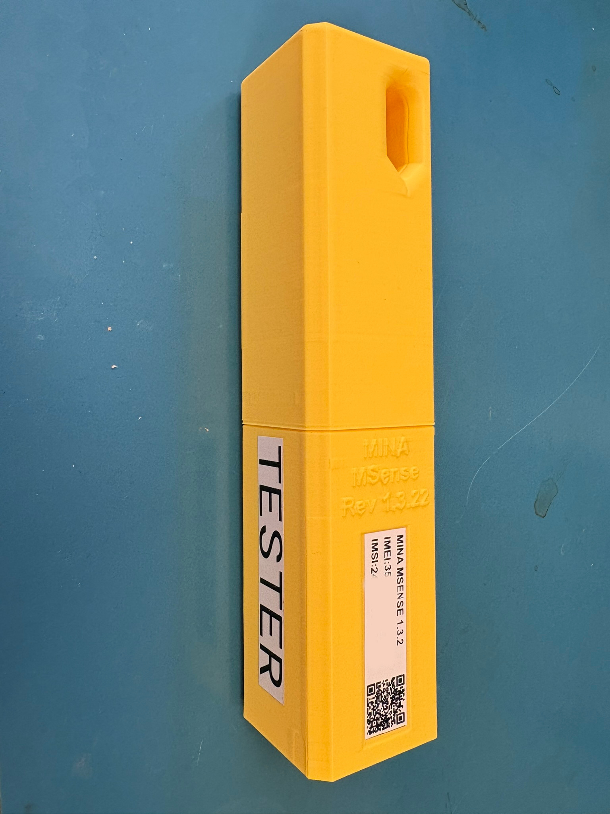
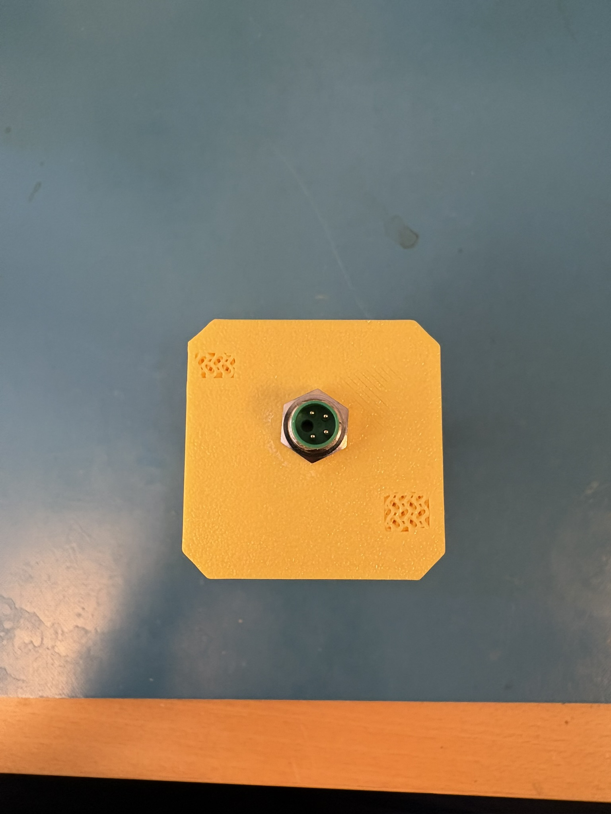

# Methanesense

 <!-- 3D rendered pretty view -->

Open Source hardware kicad source files for a NRF9160 based methane sensor utilizing MOX sensor.

Low power design with about 60ua average current consumption measuring Methane, temp, pressure and humidity every 30 seconds, averaging values over 5 minute samples, and transmitting 11 readings every 55 minutes. estimated battery life is 4.5 years from a 3200mah  18650 liion cell

It has an option for a GPS if necessary, but this will cause reduced battery life. 

[Assembly IBOM](https://htmlpreview.github.io/?https://raw.githubusercontent.com/fredriknk/Methanesense/main/DOCUMENTATION/ibom.html) <!-- Interactive BOM PDF -->

[PCB layout](./DOCUMENTATION/Methanesense_board_prints.pdf) <!-- PDFs of boards -->

[SCHEMATIC](./DOCUMENTATION/Methanesense_schematic.pdf) <!-- Schematic PDFs -->

## FRONT

## BACK

## SIDE

## Enclosure
Enclosure proposal. Simple 3d printed design snap lock, potential for epoxy fill for moisture resistance. But for now i just coat them in PLASTIK 70 conformal coating by Kontakt Chemie. DO REMEMBER TO SEAL SENSOR HOLES!!!

When 3d printing the enclosure, modify the two boxes in the sensor holes to be printed with gyroid infill with no walls or top/bottom to create the mesh. Enclosure files are in the [3D_MODEL](./3D_MODEL/) folder.

## Documentation

[NRF9160SOC](./DOCUMENTATION/Datasheets/nRF9160_PS_v2.0.pdf)

[ADC](./DOCUMENTATION/Datasheets/ads1113.pdf)

[Temp/press/humidity sensor](./DOCUMENTATION/Datasheets/bst-bme680-ds001.pdf)

[Powersupply PMIC](./DOCUMENTATION/Datasheets/nPM1300_PS_v1.0.pdf)

[MOX Sensor](./DOCUMENTATION/Datasheets/tgs8410_product_infomation(en)_rev05.pdf)

# Before major commmits
Remember to run generate_outputs.bat/sh
to update the outputs and pictures.
readmetemplate